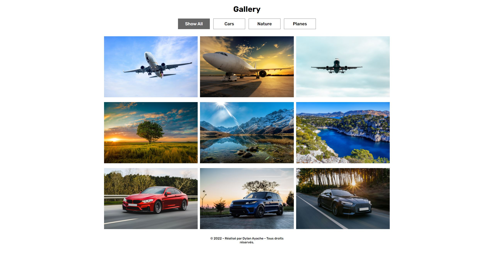

# Frontend Project - JavaScript Gallery

## Welcome! 👋

Thanks for checking out this front-end personal project.

## The Project

It's a JavaScript vanilla project. 
There is a filter functionality which allows you to filter by categories the differents pictures.
Another functionality which is the modal, when you click on a picture it will open it bigger.
The last functionality is the slider one, you can browse trough the difference pictures according to which filter is on.

Stacks used :
- JavaScript
- HTML5
- CSS3

**Don't hesitate to contact me for further informations!** 🚀
